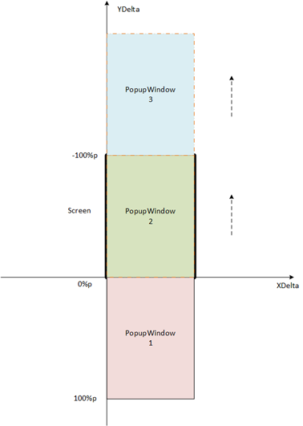
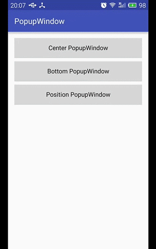

## PopupWindow

### 中央位置的PopupWindow

将自定义PopupWindow布局显示在Activity中央位置，并且屏蔽PopupWindow之外的其他区域。

**xml布局**

布局中额外加上LinearLayout，主要是因为PopupWindow会将最外层的Layout失效，会影响到中央位置的设置

```xml
<?xml version="1.0" encoding="utf-8"?>
<RelativeLayout xmlns:android="http://schemas.android.com/apk/res/android"
    android:layout_width="match_parent"
    android:layout_height="match_parent"
    android:background="#66000000">

    <LinearLayout
        android:layout_width="match_parent"
        android:layout_height="60dp"
        android:layout_centerVertical="true"
        android:orientation="horizontal"
        android:padding="10dp">

        <Button
            android:id="@+id/btn_edit"
            android:layout_width="wrap_content"
            android:layout_height="match_parent"
            android:layout_weight="1"
            android:background="@color/colorDarkCyan"
            android:gravity="center"
            android:text="@string/text_eidt"
            android:textAllCaps="false"
            android:textColor="@color/colorWhiteSmoke"
            android:textSize="16sp" />

        <View
            android:layout_width="2dp"
            android:layout_height="match_parent"
            android:background="@color/colorWhiteSmoke" />

        <Button
            android:id="@+id/btn_cancel"
            android:layout_width="wrap_content"
            android:layout_height="match_parent"
            android:layout_weight="1"
            android:background="@color/colorDarkCyan"
            android:gravity="center"
            android:text="@string/text_cancel"
            android:textAllCaps="false"
            android:textColor="@color/colorWhiteSmoke"
            android:textSize="16sp" />
    </LinearLayout>
</RelativeLayout>
```

**自定义动画样式**

创建动画资源目录res/anim，并在此目录创建两个资源文件：context_menu_enter.xml / context_menu_exit.xml
然后依据此两个动画创建一个动画样式contextMenuAnim，用于PopupWindow

res/anim/context_menu_enter.xml (进入动画效果)

```xml
<?xml version="1.0" encoding="utf-8"?>
<set xmlns:android="http://schemas.android.com/apk/res/android">
    <translate
        android:duration="@android:integer/config_shortAnimTime"
        android:fromXDelta="0"
        android:fromYDelta="100%p"
        android:interpolator="@android:anim/accelerate_decelerate_interpolator"
        android:toXDelta="0"
        android:toYDelta="0"/>
</set>
```

res/anim/context_menu_exit.xml (退出动画效果)

```xml
<?xml version="1.0" encoding="utf-8"?>
<set xmlns:android="http://schemas.android.com/apk/res/android">
    <translate
        android:duration="@android:integer/config_shortAnimTime"
        android:fromXDelta="0"
        android:fromYDelta="0"
        android:interpolator="@android:anim/accelerate_decelerate_interpolator"
        android:toXDelta="0"
        android:toYDelta="100%p"/>
</set>
```

res/values/styles.xml (动画样式)

```xml
    <style name="contextMenuAnim" parent="@android:style/Animation.Activity">
        <item name="android:windowEnterAnimation">@anim/context_menu_enter</item>
        <item name="android:windowExitAnimation">@anim/context_menu_exit</item>
    </style>
```

关于translate移动方向和位置的示意图：



**示例代码**

```java
@SuppressLint("InflateParams")
private void showCenterPopupWindow() {
    View view = getLayoutInflater().inflate(R.layout.layout_popupwindow_center, null);
    Button mEditBtn = (Button) view.findViewById(R.id.btn_edit);
    Button mCancelBtn = (Button) view.findViewById(R.id.btn_cancel);
    mEditBtn.setOnClickListener(this);
    mCancelBtn.setOnClickListener(this);

    mPopupWindow = new PopupWindow(view);       // 点击外部区域,弹窗不消失

    // 为PopupWindow菜单添加阴影时，其宽度和高度必须都设置为MATCH_PARENT
    mPopupWindow.setWidth(ViewGroup.LayoutParams.MATCH_PARENT);
    mPopupWindow.setHeight(ViewGroup.LayoutParams.MATCH_PARENT);

    ColorDrawable mColorDrawable = new ColorDrawable(0);
    mPopupWindow.setBackgroundDrawable(mColorDrawable);

    mPopupWindow.setAnimationStyle(R.style.contextMenuAnim);    // 自定义动画样式
    // mPopupWindow.setAnimationStyle(android.R.style.Animation_Translucent);

    mPopupWindow.getBackground().setAlpha(100);
    mPopupWindow.setOutsideTouchable(true);         // 点击PopupWindow以外区域，自动消失，这里PopupWindow为MATCH_PARENT，故无效
    mPopupWindow.setFocusable(true);                // 如果PopupWindow中有Editor的话，focusable要为true
    mPopupWindow.setTouchable(true);                //
    mPopupWindow.setSoftInputMode(WindowManager.LayoutParams.SOFT_INPUT_ADJUST_RESIZE);

    View rootView = LayoutInflater.from(MainActivity.this).inflate(R.layout.activity_main, null);
    mPopupWindow.showAtLocation(rootView, Gravity.CENTER, 0, 0);
}
```

**示例效果**


### 底部位置的PopupWindow

**xml布局**

```xml
<?xml version="1.0" encoding="utf-8"?>
<LinearLayout xmlns:android="http://schemas.android.com/apk/res/android"
    android:orientation="vertical"
    android:layout_width="match_parent"
    android:layout_height="wrap_content"
    android:layout_margin="16dp"
    android:padding="16dp">

    <Button
        android:id="@+id/btn_open"
        android:layout_width="match_parent"
        android:layout_height="48dp"
        android:background="#7aab43"
        android:textAllCaps="false"
        android:textColor="#FFFFFF"
        android:textSize="16sp"
        android:text="@string/text_open" />

    <Button
        android:id="@+id/btn_save_as"
        android:layout_width="match_parent"
        android:layout_height="48dp"
        android:layout_marginTop="8dp"
        android:background="#d94d4d"
        android:textAllCaps="false"
        android:textColor="#FFFFFF"
        android:textSize="16sp"
        android:text="@string/text_save_as" />

    <Button
        android:id="@+id/btn_close"
        android:layout_width="match_parent"
        android:layout_height="48dp"
        android:layout_marginTop="8dp"
        android:background="#2464ca"
        android:textAllCaps="false"
        android:textColor="#FFFFFF"
        android:textSize="16sp"
        android:text="@string/text_close" />
</LinearLayout>
```

**示例代码**

```java
@SuppressLint("InflateParams")
private void showBottomPopupWindow() {
    setBackgroundAlpha(0.5f);               // 设置背景透明度

    View view = getLayoutInflater().inflate(R.layout.layout_popupwindow_bottom, null);
    Button mOpenBtn = (Button) view.findViewById(R.id.btn_open);
    Button mSaveAsBtn = (Button) view.findViewById(R.id.btn_save_as);
    Button mCloseBtn = (Button) view.findViewById(R.id.btn_close);
    mOpenBtn.setOnClickListener(this);
    mSaveAsBtn.setOnClickListener(this);
    mCloseBtn.setOnClickListener(this);

    // PopupWindow会丢弃掉最外层的父局部，故第二个LinearLayout才会起作用
    mPopupWindow = new PopupWindow(view);
    mPopupWindow.setWidth(ViewGroup.LayoutParams.MATCH_PARENT);
    mPopupWindow.setHeight(ViewGroup.LayoutParams.WRAP_CONTENT);

    // 背景
    ColorDrawable cd = new ColorDrawable(0);
    mPopupWindow.setBackgroundDrawable(cd);

    mPopupWindow.setAnimationStyle(android.R.style.Animation_Translucent);

    View rootView = LayoutInflater.from(MainActivity.this).inflate(R.layout.activity_main, null);
    mPopupWindow.showAtLocation(rootView, Gravity.BOTTOM, 0, 0);    // showAtLocation()显示在指定位置
    mPopupWindow.setOnDismissListener(new PopupWindow.OnDismissListener() {
        @Override
        public void onDismiss() {
            setBackgroundAlpha(1.0f);       // 恢复背景透明度
        }
    });
}

// 设置屏幕背景透明度
private void setBackgroundAlpha(float alpha){
    WindowManager.LayoutParams mLayoutParams = getWindow().getAttributes();
    mLayoutParams.alpha = alpha;
    getWindow().setAttributes(mLayoutParams);
}
```

**示例效果**


### 参照View位置的PopupWindow

**xml布局**

```xml
<?xml version="1.0" encoding="utf-8"?>
<LinearLayout xmlns:android="http://schemas.android.com/apk/res/android"
    android:orientation="vertical"
    android:layout_width="match_parent"
    android:layout_height="wrap_content">

    <LinearLayout
        android:orientation="vertical"
        android:layout_width="match_parent"
        android:layout_height="match_parent"
        android:layout_margin="16dp">

        <Button
            android:id="@+id/btn_share"
            style="?android:attr/buttonStyleSmall"
            android:layout_width="160dp"
            android:layout_height="wrap_content"
            android:background="#b6c93c"
            android:textColor="#FFFFFF"
            android:textAllCaps="false"
            android:text="@string/text_share" />

        <Button
            android:id="@+id/btn_collect"
            style="?android:attr/buttonStyleSmall"
            android:layout_width="180dp"
            android:layout_height="wrap_content"
            android:layout_marginTop="8dp"
            android:background="#3cc998"
            android:textColor="#FFFFFF"
            android:textAllCaps="false"
            android:text="@string/text_collect" />

        <Button
            android:id="@+id/btn_exit"
            style="?android:attr/buttonStyleSmall"
            android:layout_width="200dp"
            android:layout_height="wrap_content"
            android:layout_marginTop="8dp"
            android:background="#3ca8c9"
            android:textColor="#FFFFFF"
            android:textAllCaps="false"
            android:text="@string/text_exit" />
    </LinearLayout>
</LinearLayout>
```

**示例代码**

```java
@SuppressLint("InflateParams")
private void showPositionPopupWindow() {
    View view = getLayoutInflater().inflate(R.layout.layout_popupwindow_position, null);
    Button mShareBtn = (Button) view.findViewById(R.id.btn_share);
    Button mCollectBtn = (Button) view.findViewById(R.id.btn_collect);
    Button mExitBtn = (Button) view.findViewById(R.id.btn_exit);
    mShareBtn.setOnClickListener(this);
    mCollectBtn.setOnClickListener(this);
    mExitBtn.setOnClickListener(this);

    mPopupWindow = new PopupWindow(view);
    mPopupWindow.setWidth(ViewGroup.LayoutParams.MATCH_PARENT);
    mPopupWindow.setHeight(ViewGroup.LayoutParams.WRAP_CONTENT);

    ColorDrawable cd = new ColorDrawable(0);
    mPopupWindow.setBackgroundDrawable(cd);

    mPopupWindow.setAnimationStyle(android.R.style.Animation_Translucent);

    mPopupWindow.showAsDropDown(mPositionPopupWindowBtn);   // showAsDropDown()显示在一个参照视图View的周围
}
```

**示例效果**


